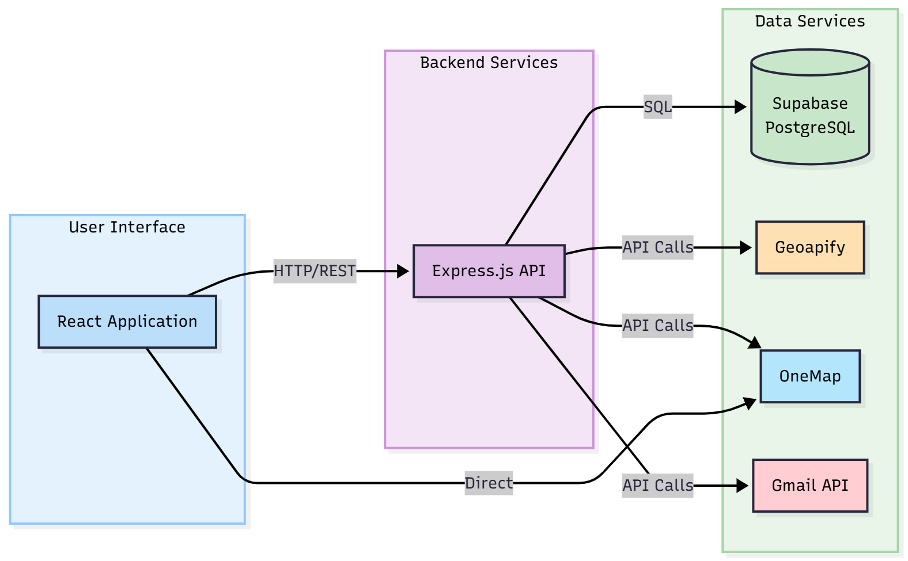
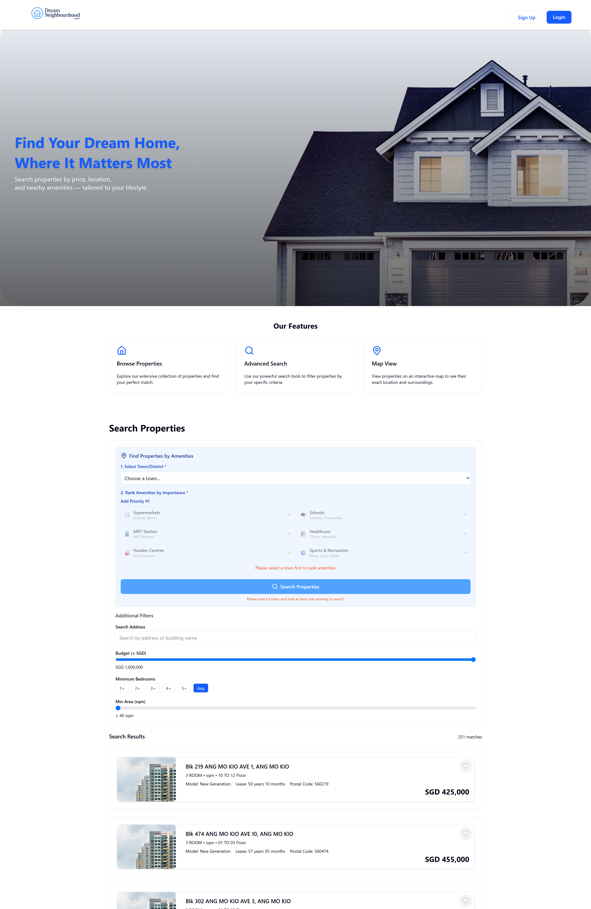
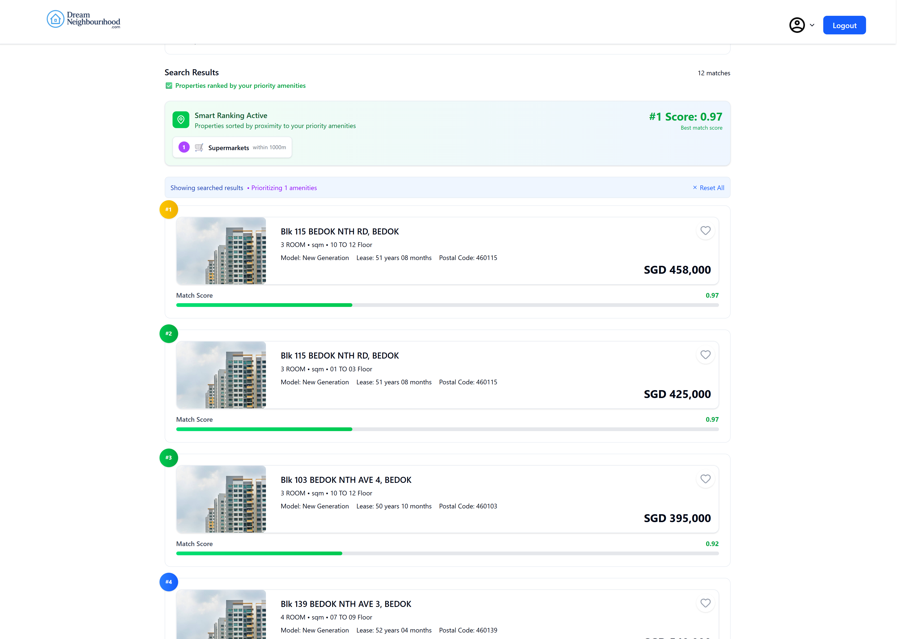
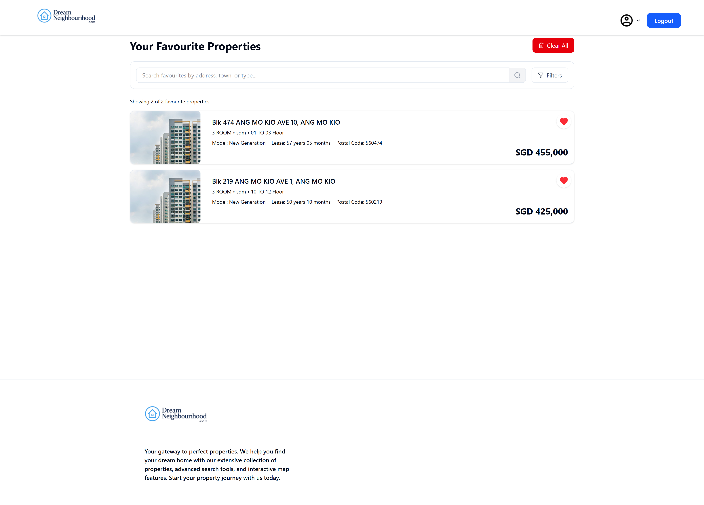

# 🏡 Dream Neighbourhood — 2006-SCSB-32

This project helps home seekers discover properties tailored to their lifestyle.  
Users rank the amenities that matter most to them, and the system calculates scores for each property based on proximity to these ranked amenities.  
The best-matched homes are then displayed in sorted order — a personalized and data-driven home recommendation experience.


## 📋 Table of Contents

- [🛠 Technologies Used](#technologies-used)
- [✅ Prerequisites](#prerequisites)
- [💻 Installation](#installation)
- [🔑 API Keys and Environment Variables](#api-keys-and-environment-variables)
- [🗄 Database Setup (Supabase)](#database-setup-supabase)
- [🚀 Running the Project](#running-the-project)
- [📌 API Documentation](#api-documentation)
- [🏗 System Architecture](#system-architecture)
- [🖼 Screenshots](#screenshots)
- [🤝 Contributing](#contributing)
- [📄 License](#license)

---

<h2 id="technologies-used">🛠 Technologies Used</h2>

### 📌 Core Stack
| Layer | Technologies |
|-------|--------------|
| Frontend | React, Vite ⚡ |
| Backend | Node.js, Express.js 🟢 |
| Database | Supabase (PostgreSQL) 🗄 |
| Styling | Tailwind CSS 🎨 |

### 🔧 Tools
| Tool | Usage |
|------|-------|
| Postman | API Testing |
| VS Code | IDE |
| Geoapify | Geocoding & amenity proximity data |
| GitHub | Version control & collaboration |

---
## ✅ Prerequisites
| Requirement | Version |
|------------|---------|
| Node.js | v22.14.0 ✅ |
| npm | Latest recommended 📦 |
| Supabase Account | Required 🔑 |

Download Node.js 👉 https://nodejs.org/  
Create Supabase 👉 https://supabase.com/
 

---
<h2 id="installation">💻 Installation</h2>

1. Clone the repository:

```bash
git clone https://github.com/softwarelab3/2006-SCSB-32.git
cd 2006-SCSB-32
```
2. Install dependencies:
```bash
#Installation for frontend
cd dreamneighbourhood/frontend
npm install

#Installation for backend
cd ../backend
npm install
```
<h2 id="api-keys-and-environment-variables">🔑 API Keys and Environment Variables</h2>

Create .env files in both frontend and backend directories.

Frontend .env example:
```.env
VITE_API_BASE_URL=http://localhost:5000/api/v1


```
Backend .env example:
Regarding the EMAIL_PASS and EMAIL_USER variable, it is used for gmail email smtp, the EMAIL_PASS have to be accquired under your google gmail account settings, search APP password.

```.env
SUPABASE_URL=YOUR_SUPABASE_PROJECT_URL
SUPABASE_SERVICE_ROLE_KEY=YOUR_SUPABASE_SERVICE_ROLE_KEY
PORT=5000
BASE_URL=http://localhost:5000
EMAIL_PASS=YOUR_APP_PASSWORD
EMAIL_USER=YOUR_EMAIL_ADDRESS
JWT_SECRET=YOUR_GENERATED_JWT_SECRET
ENCRYPTION_KEY=32B_encryption_key_1234567890abcdef
GEOAPIFY_API_KEY=YOUR_GEOAPIFY_KEY


```
⚠️ Never commit .env files to GitHub
<h2 id="database-setup-supabase">🗄 Database Setup (Supabase)</h2>

### 1. Create a Supabase Project
1. Go to Supabase → create a new project.
2. Note Project URL and anon/service role key (used in .env).

### 2. Create Tables
Properties table:
```sql
create table public.properties (
  id serial not null,
  town text not null,
  flat_type text not null,
  flat_model text null,
  floor_area numeric null,
  lease_commence_date integer null,
  remaining_lease text null,
  street_name text null,
  block text null,
  storey_range text null,
  resale_price numeric null,
  latitude numeric null,
  longitude numeric null,
  postal_code character varying(10) null,
  address text null,
  constraint properties_pkey primary key (id)
) TABLESPACE pg_default;
```
User favorites table:
```sql
create table public.user_favorites (
  id serial not null,
  user_id uuid not null,
  property_id integer not null,
  created_at timestamp without time zone null default CURRENT_TIMESTAMP,
  constraint user_favorites_pkey primary key (id),
  constraint user_favorites_property_id_fkey foreign KEY (property_id) references properties (id) on delete CASCADE,
  constraint user_favorites_user_id_fkey foreign KEY (user_id) references users (id) on delete CASCADE
) TABLESPACE pg_default;
```
Users table:
```sql
create table public.users (
  id uuid not null default gen_random_uuid (),
  username text not null,
  email text not null,
  password text not null,
  verification_token text null,
  is_verified boolean not null default false,
  created_at timestamp without time zone null default now(),
  reset_token text null,
  reset_token_expiry timestamp without time zone null,
  constraint users_pkey primary key (id),
  constraint users_email_key unique (email)
) TABLESPACE pg_default;
```
### 3. ✅ Populate the Database (Properties Table)
From the backend folder:
```bash
cd backend
npm run populate

```
⚠️ Ensure the properties table exists and the .env file has valid Supabase keys.


<h2 id="running-the-project">🚀 Running the Project</h2>

Development
Backend:
```bash
cd dreamneighbourhood/backend
npm run dev
```
Frontend:
```bash
cd dreamneighbourhood/frontend
npm run dev

```
Access:
Frontend: http://localhost:5173
Backend: http://localhost:5000

<h2 id="api-documentation">📌 API Documentation</h2>

All endpoints are prefixed with `/api/v1`. Protected routes require authentication (`authenticateToken`).

| Method | Endpoint | Description | Request Body / Query Parameters |
|--------|---------|-------------|-------------------------------|
| **Users** |  |  |  |
| POST | `/api/v1/users/register` | Register a new user | `{ "username": "...", "email": "...", "password": "..." }` |
| GET | `/api/v1/users/verify-email` | Verify user email | Query param: `token=...` |
| POST | `/api/v1/users/login` | Login a user | `{ "email": "...", "password": "..." }` |
| POST | `/api/v1/users/forgot-password` | Request password reset | `{ "email": "..." }` |
| POST | `/api/v1/users/reset-password` | Reset password using token | `{ "token": "...", "newPassword": "..." }` |
| GET | `/api/v1/users/profile` | Get authenticated user profile | Protected (Bearer token) |
| POST | `/api/v1/users/change-password` | Change user password | `{ "oldPassword": "...", "newPassword": "..." }` Protected |
| POST | `/api/v1/users/change-email` | Change user email | `{ "newEmail": "..." }` Protected |
| DELETE | `/api/v1/users/delete-account` | Delete user account | Protected |
| POST | `/api/v1/users/refresh-token` | Refresh JWT token | `{ "refreshToken": "..." }` Protected |
| POST | `/api/v1/users/send-verification-email` | Resend verification email | Protected |
| **Favourites** |  |  |  |
| GET | `/api/v1/favourites/` | View all favourite properties for authenticated user | Protected |
| POST | `/api/v1/favourites/add` | Add a property to favourites | `{ "propertyId": 1 }` Protected |
| DELETE | `/api/v1/favourites/:property_id` | Remove a property from favourites | Path param: `property_id` Protected |
| **Properties** |  |  |  |
| GET | `/api/v1/properties/default` | Fetch default property list | None |
| GET | `/api/v1/properties/:id` | Fetch property by ID | Path param: `id` |
| **Search** |  |  |  |
| POST | `/api/v1/search/rank-properties` | Rank properties based on user's amenities | `{ "amenities": [{ "amenityTheme": "...", "rank": 1, "maxDistance": 1000 }] }` |

> ⚡ Tip: All POST requests require JSON bodies. Authentication is required for routes marked as Protected.

<h2 id="system-architecture">🏗 System Architecture</h2>

A visual diagram of how the frontend, backend, database, and third-party services interact.  



<h2 id="screenshots">🖼 Screenshots</h2>

Frontend home page:  


Property ranking view:  


Favorites page:  



<h2 id="contributing">🤝 Contributing</h2>

1. Fork the repository
2. Create a feature branch 
```bash
git checkout -b feature/your-feature-name

```
3. Commit changes
```bash
git commit -m "Add new feature"

```
4. Push to the branch 
```bash
git push origin feature/your-feature-name

```
5. Open a Pull Request


<h2 id="license">📄 License</h2>
Academic project submission (NTU — Software Engineering Course)
Not licensed for commercial use.


